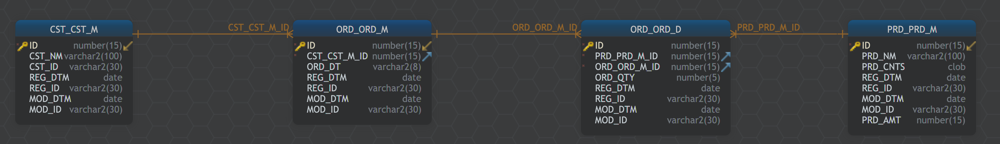
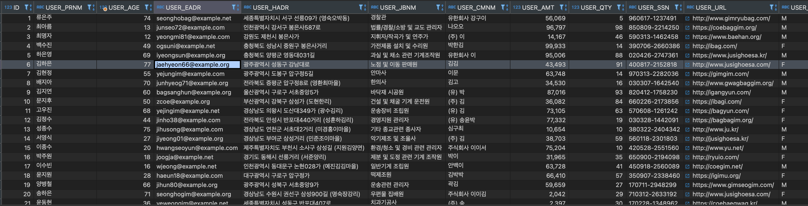

# Purpose
Create `Mock Data` to `Oracle Table`

# requierments
```
cx-Oracle==8.3.0
Faker==15.3.3
faker-vehicle==0.2.0
python-dateutil==2.8.2
six==1.16.0
typing_extensions==4.4.0
```

# install
```bash
pip install -r requierments.txt
```

# config
Create `config.ini` file in your project root.
```
[oracle_connect_info]
db_host = X.X.X.X
db_port = 1521
db_name = orcl
db_username = obj_own
db_password = obj_own

[table_info]
total_row_cnt = 1000
commit_cnt = 100
owner = OBJ_OWN
table_name = TEST
```

# example table
```sql

CREATE TABLE POC_OWN.CST_CST_M ( 
	id number(15) not null,
	cst_nm varchar2(100),
	cst_id varchar2(30),
	reg_dtm date,
	reg_id varchar2(30),
	mod_dtm date,
	mod_id varchar2(30)
) TABLESPACE USERS;

CREATE UNIQUE INDEX POC_OWN.PK_CST_CST_M ON POC_OWN.CST_CST_M ( 
id) TABLESPACE USERS;

ALTER TABLE POC_OWN.CST_CST_M ADD CONSTRAINT PK_CST_CST_M PRIMARY KEY ( 
id);

CREATE OR REPLACE PUBLIC SYNONYM CST_CST_M FOR POC_OWN.CST_CST_M;

GRANT SELECT ON POC_OWN.CST_CST_M TO RL_SM_SEL;
GRANT SELECT,UPDATE,DELETE,INSERT ON POC_OWN.CST_CST_M TO [grantee];

COMMENT ON TABLE POC_OWN.CST_CST_M IS '고객기본';
COMMENT ON COLUMN POC_OWN.CST_CST_M.id IS 'ID';
COMMENT ON COLUMN POC_OWN.CST_CST_M.cst_nm IS '고객명';
COMMENT ON COLUMN POC_OWN.CST_CST_M.cst_id IS '고객ID';
COMMENT ON COLUMN POC_OWN.CST_CST_M.reg_dtm IS '등록일시';
COMMENT ON COLUMN POC_OWN.CST_CST_M.reg_id IS '등록ID';
COMMENT ON COLUMN POC_OWN.CST_CST_M.mod_dtm IS '수정일시';
COMMENT ON COLUMN POC_OWN.CST_CST_M.mod_id IS '수정ID';

CREATE TABLE POC_OWN.ORD_ORD_D ( 
	id number(15) not null,
	prd_prd_m_id number(15) not null,
	ord_ord_m_id number(15) not null,
	ord_qty number(5),
	reg_dtm date,
	reg_id varchar2(30),
	mod_dtm date,
	mod_id varchar2(30)
) TABLESPACE USERS;

CREATE UNIQUE INDEX POC_OWN.PK_ORD_ORD_D ON POC_OWN.ORD_ORD_D ( 
id) TABLESPACE USERS;

ALTER TABLE POC_OWN.ORD_ORD_D ADD CONSTRAINT PK_ORD_ORD_D PRIMARY KEY ( 
id);

CREATE OR REPLACE PUBLIC SYNONYM ORD_ORD_D FOR POC_OWN.ORD_ORD_D;

GRANT SELECT ON POC_OWN.ORD_ORD_D TO RL_SM_SEL;
GRANT SELECT,UPDATE,DELETE,INSERT ON POC_OWN.ORD_ORD_D TO [grantee];

COMMENT ON TABLE POC_OWN.ORD_ORD_D IS '주문상세';
COMMENT ON COLUMN POC_OWN.ORD_ORD_D.id IS 'ID';
COMMENT ON COLUMN POC_OWN.ORD_ORD_D.prd_prd_m_id IS '상품기본ID';
COMMENT ON COLUMN POC_OWN.ORD_ORD_D.ord_ord_m_id IS '주문기본ID';
COMMENT ON COLUMN POC_OWN.ORD_ORD_D.ord_qty IS '주문수량';
COMMENT ON COLUMN POC_OWN.ORD_ORD_D.reg_dtm IS '등록일시';
COMMENT ON COLUMN POC_OWN.ORD_ORD_D.reg_id IS '등록ID';
COMMENT ON COLUMN POC_OWN.ORD_ORD_D.mod_dtm IS '수정일시';
COMMENT ON COLUMN POC_OWN.ORD_ORD_D.mod_id IS '수정ID';

CREATE TABLE POC_OWN.ORD_ORD_M ( 
	id number(15) not null,
	cst_cst_m_id number(15) not null,
	ord_dt varchar2(8),
	reg_dtm date,
	reg_id varchar2(30),
	mod_dtm date,
	mod_id varchar2(30)
) TABLESPACE USERS;

CREATE UNIQUE INDEX POC_OWN.PK_ORD_ORD_M ON POC_OWN.ORD_ORD_M ( 
id) TABLESPACE USERS;

ALTER TABLE POC_OWN.ORD_ORD_M ADD CONSTRAINT PK_ORD_ORD_M PRIMARY KEY ( 
id);

CREATE OR REPLACE PUBLIC SYNONYM ORD_ORD_M FOR POC_OWN.ORD_ORD_M;

GRANT SELECT ON POC_OWN.ORD_ORD_M TO RL_SM_SEL;
GRANT SELECT,UPDATE,DELETE,INSERT ON POC_OWN.ORD_ORD_M TO [grantee];

COMMENT ON TABLE POC_OWN.ORD_ORD_M IS '주문기본';
COMMENT ON COLUMN POC_OWN.ORD_ORD_M.id IS 'ID';
COMMENT ON COLUMN POC_OWN.ORD_ORD_M.cst_cst_m_id IS '고객마스터ID';
COMMENT ON COLUMN POC_OWN.ORD_ORD_M.ord_dt IS '주문일자';
COMMENT ON COLUMN POC_OWN.ORD_ORD_M.reg_dtm IS '등록일시';
COMMENT ON COLUMN POC_OWN.ORD_ORD_M.reg_id IS '등록ID';
COMMENT ON COLUMN POC_OWN.ORD_ORD_M.mod_dtm IS '수정일시';
COMMENT ON COLUMN POC_OWN.ORD_ORD_M.mod_id IS '수정ID';


CREATE TABLE POC_OWN.PRD_PRD_M ( 
	id number(15) not null,
	prd_nm varchar2(100),
	prd_cnts clob,
	reg_dtm date,
	reg_id varchar2(30),
	mod_dtm date,
	mod_id varchar2(30),
	prd_amt number(15)
) TABLESPACE USERS;

CREATE UNIQUE INDEX POC_OWN.PK_PRD_PRD_M ON POC_OWN.PRD_PRD_M ( 
id) TABLESPACE USERS;

ALTER TABLE POC_OWN.PRD_PRD_M ADD CONSTRAINT PK_PRD_PRD_M PRIMARY KEY ( 
id);

CREATE OR REPLACE PUBLIC SYNONYM PRD_PRD_M FOR POC_OWN.PRD_PRD_M;

GRANT SELECT ON POC_OWN.PRD_PRD_M TO RL_SM_SEL;
GRANT SELECT,UPDATE,DELETE,INSERT ON POC_OWN.PRD_PRD_M TO [grantee];

COMMENT ON TABLE POC_OWN.PRD_PRD_M IS '상품기본';
COMMENT ON COLUMN POC_OWN.PRD_PRD_M.id IS 'ID';
COMMENT ON COLUMN POC_OWN.PRD_PRD_M.prd_nm IS '상품명';
COMMENT ON COLUMN POC_OWN.PRD_PRD_M.prd_cnts IS '상품내용';
COMMENT ON COLUMN POC_OWN.PRD_PRD_M.reg_dtm IS '등록일시';
COMMENT ON COLUMN POC_OWN.PRD_PRD_M.reg_id IS '등록ID';
COMMENT ON COLUMN POC_OWN.PRD_PRD_M.mod_dtm IS '수정일시';
COMMENT ON COLUMN POC_OWN.PRD_PRD_M.mod_id IS '수정ID';
COMMENT ON COLUMN POC_OWN.PRD_PRD_M.prd_amt IS '상품가격';
```

# model


# testing
```bash
$ python mock_data.py
## Info :  DB Connected
## Info :  Start ID : 1
## Info :  Commit : 100
## Info :  Commit : 100
## Info :  Commit : 100
## Info :  Commit : 100
## Info :  Commit : 100
## Info :  Commit : 100
## Info :  Commit : 100
## Info :  Commit : 100
## Info :  Commit : 100
## Info :  Commit : 100
## Info :  Elapsed Time : 3.33 sec
$
```

# result
```sql
SELECT *
FROM OBJ_OWN.TEST;
```
